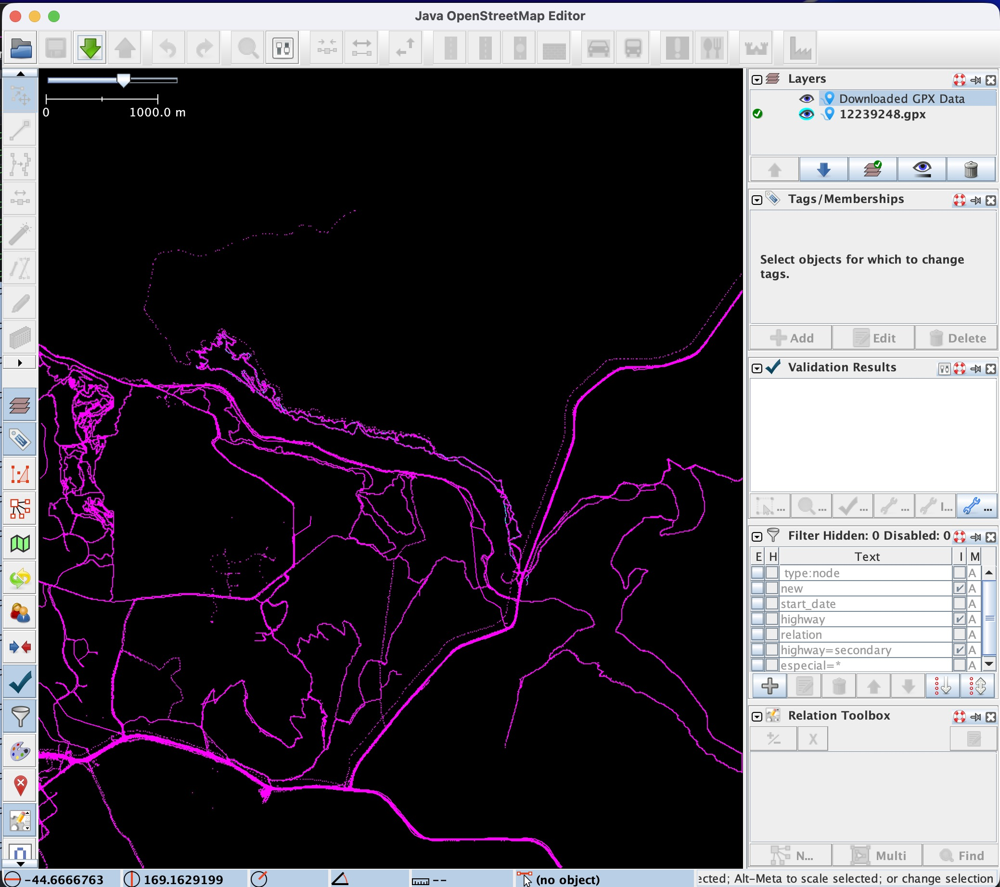

# GPS Trace Download Performance in JOSM



## Test Parameters

| Parameter | Value |
|---|---|
| **Editor** | JOSM |
| **API Endpoint** | `GET /api/0.6/trackpoints` |
| **Bounding box** | `169.1362205,-44.7030215,169.2156674,-44.6388039` |
| **Location** | Queenstown area, New Zealand |
| **Bbox size** | ~0.08 x 0.06 degrees (~7 km x 7 km) |
| **Pages requested** | 17 (pages 0–16), ~5,000 points per page |
| **Total points** | ~85,000 tracepoints |
| **Total time** | ~43 seconds |
| **Avg response time** | ~2.5 s per request |
| **Date** | 2026-03-11 |

## Raw JOSM Log

```
2026-03-11 22:05:17.321 INFO: GET https://api.openstreetmap.org/api/0.6/trackpoints?bbox=169.1362205,-44.7030215,169.2156674,-44.6388039&page=0 -> HTTP/1.1 200 (2.4 s)
2026-03-11 22:05:19.952 INFO: GET https://api.openstreetmap.org/api/0.6/trackpoints?bbox=169.1362205,-44.7030215,169.2156674,-44.6388039&page=1 -> HTTP/1.1 200 (1.9 s)
2026-03-11 22:05:21.712 INFO: GET https://api.openstreetmap.org/api/0.6/trackpoints?bbox=169.1362205,-44.7030215,169.2156674,-44.6388039&page=2 -> HTTP/1.1 200 (1.5 s)
2026-03-11 22:05:23.660 INFO: GET https://api.openstreetmap.org/api/0.6/trackpoints?bbox=169.1362205,-44.7030215,169.2156674,-44.6388039&page=3 -> HTTP/1.1 200 (1.8 s)
2026-03-11 22:05:25.300 INFO: GET https://api.openstreetmap.org/api/0.6/trackpoints?bbox=169.1362205,-44.7030215,169.2156674,-44.6388039&page=4 -> HTTP/1.1 200 (1.5 s)
2026-03-11 22:05:27.036 INFO: GET https://api.openstreetmap.org/api/0.6/trackpoints?bbox=169.1362205,-44.7030215,169.2156674,-44.6388039&page=5 -> HTTP/1.1 200 (1.6 s)
2026-03-11 22:05:28.627 INFO: GET https://api.openstreetmap.org/api/0.6/trackpoints?bbox=169.1362205,-44.7030215,169.2156674,-44.6388039&page=6 -> HTTP/1.1 200 (1.5 s)
2026-03-11 22:05:30.827 INFO: GET https://api.openstreetmap.org/api/0.6/trackpoints?bbox=169.1362205,-44.7030215,169.2156674,-44.6388039&page=7 -> HTTP/1.1 200 (2.1 s)
2026-03-11 22:05:33.387 INFO: GET https://api.openstreetmap.org/api/0.6/trackpoints?bbox=169.1362205,-44.7030215,169.2156674,-44.6388039&page=8 -> HTTP/1.1 200 (2.5 s)
2026-03-11 22:05:35.741 INFO: GET https://api.openstreetmap.org/api/0.6/trackpoints?bbox=169.1362205,-44.7030215,169.2156674,-44.6388039&page=9 -> HTTP/1.1 200 (2.3 s)
2026-03-11 22:05:39.952 INFO: GET https://api.openstreetmap.org/api/0.6/trackpoints?bbox=169.1362205,-44.7030215,169.2156674,-44.6388039&page=10 -> HTTP/1.1 200 (4.2 s)
2026-03-11 22:05:44.356 INFO: GET https://api.openstreetmap.org/api/0.6/trackpoints?bbox=169.1362205,-44.7030215,169.2156674,-44.6388039&page=11 -> HTTP/1.1 200 (3.7 s)
2026-03-11 22:05:47.624 INFO: GET https://api.openstreetmap.org/api/0.6/trackpoints?bbox=169.1362205,-44.7030215,169.2156674,-44.6388039&page=12 -> HTTP/1.1 200 (2.6 s)
2026-03-11 22:05:51.201 INFO: GET https://api.openstreetmap.org/api/0.6/trackpoints?bbox=169.1362205,-44.7030215,169.2156674,-44.6388039&page=13 -> HTTP/1.1 200 (3.5 s)
2026-03-11 22:05:54.132 INFO: GET https://api.openstreetmap.org/api/0.6/trackpoints?bbox=169.1362205,-44.7030215,169.2156674,-44.6388039&page=14 -> HTTP/1.1 200 (2.9 s)
2026-03-11 22:05:57.349 INFO: GET https://api.openstreetmap.org/api/0.6/trackpoints?bbox=169.1362205,-44.7030215,169.2156674,-44.6388039&page=15 -> HTTP/1.1 200 (3.2 s)
2026-03-11 22:06:00.318 INFO: GET https://api.openstreetmap.org/api/0.6/trackpoints?bbox=169.1362205,-44.7030215,169.2156674,-44.6388039&page=16 -> HTTP/1.1 200 (2.9 s)
```

## Response Time Trend

| Pages | Avg response time |
|---|---|
| 0–6 (early pages) | ~1.7 s |
| 7–9 (mid pages) | ~2.3 s |
| 10–16 (late pages) | ~3.3 s |

The response time **nearly doubles** from early to late pages.

## Why Is It Slow?

### 1. Sequential pagination
JOSM requests one page at a time, waits for the response, then requests the next. There is no parallelism — 17 sequential requests multiply the total latency.

### 2. No spatial index on the `gps_points` table
The `gps_points` table contains approximately **~31.8 billion rows** ([source: OSM database statistics](https://planet.openstreetmap.org/statistics/data_stats.html)). The API filters by bounding box using `latitude` and `longitude` columns, but these use conventional **B-tree indexes** instead of a spatial index (GiST / R-tree). B-tree indexes are not optimal for 2D range queries — the database must combine two separate index scans instead of performing a single spatial lookup.

### 3. OFFSET-based pagination degrades on later pages
PostgreSQL implements `OFFSET` by scanning and discarding rows. For page 16 (offset ~80,000), the database must scan through ~80,000 matching rows before returning the next 5,000. This explains the response time increase from ~1.7s (early pages) to ~3.3s (late pages).

### 4. Heavy XML serialization
Each response is serialized as GPX XML with thousands of `<trkpt>` elements. XML generation and parsing is significantly more expensive than binary formats like Protocol Buffers or even compressed JSON.

### 5. Single-threaded Rails request handling
Each API request is processed by a single Rails worker thread, which must query the database, build the XML response, and stream it back. There is no caching layer for trackpoint queries.

## Impact on User Experience

- A mapper opening JOSM in a moderately dense area waits **~43 seconds** just to load GPS traces
- In denser areas (cities, popular hiking regions), the wait can be significantly longer
- This discourages mappers from using GPS traces as a reference layer, reducing mapping quality


## Download format XML .gpx:

```xml
<?xml version="1.0" encoding="UTF-8"?>
<gpx version="1.0" creator="OpenStreetMap.org" xmlns="http://www.topografix.com/GPX/1/0">
  <trk>
    <trkseg>
      <trkpt lat="-44.6520200" lon="169.1688150">
      </trkpt>
      <trkpt lat="-44.6520200" lon="169.1688150">
      </trkpt>
      <trkpt lat="-44.6520160" lon="169.1649700">
      </trkpt>
      ...
    </trkseg>
  </trk>
</gpx>
```